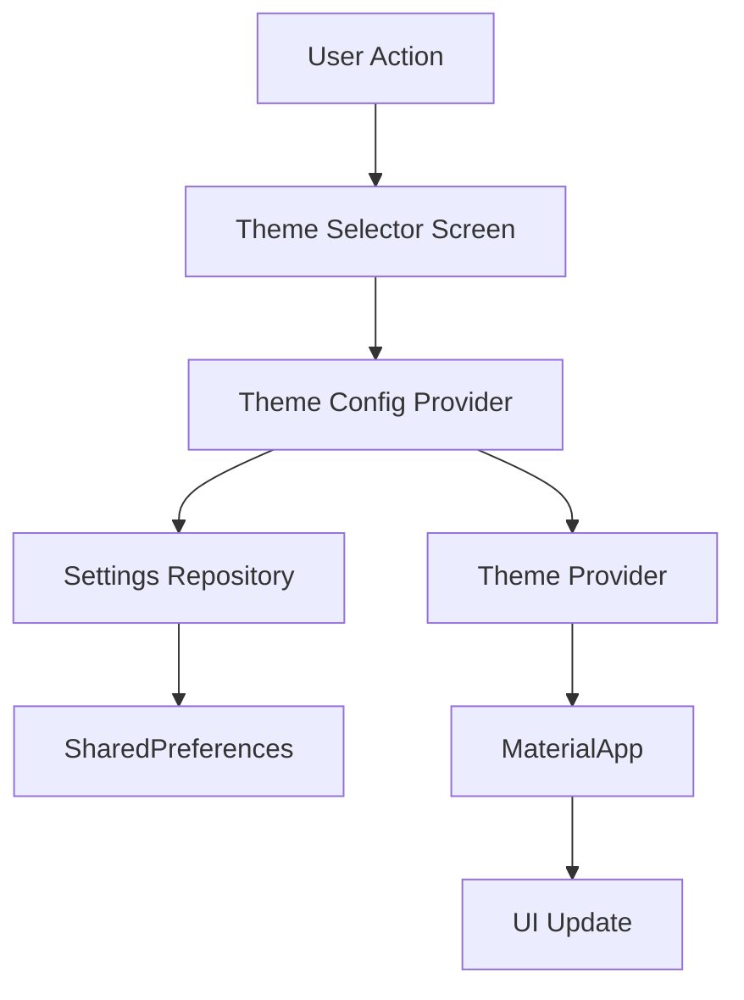

# Design Document

## Overview

This design consolidates profile management into the settings feature and implements a comprehensive theme selection system. The architecture leverages existing infrastructure (theme provider, settings repository) while adding new components for color theme management and selection UI. The design prioritizes instant visual feedback, data persistence, and clean separation of concerns.

## Architecture

### High-Level Structure

```
lib/features/settings/
├── models/
│   ├── user_profile.dart (moved from profile)
│   └── theme_config.dart (new)
├── providers/
│   ├── user_profile_provider.dart (moved from profile)
│   ├── user_profile_provider.g.dart
│   └── theme_config_provider.dart (new)
├── repositories/
│   └── user_profile_repository.dart (moved from profile)
├── screens/
│   ├── settings_screen.dart (updated)
│   └── theme_selector_screen.dart (new)
└── widgets/
    ├── profile_section.dart (new)
    ├── theme_preview_card.dart (new)
    └── unsaved_changes_dialog.dart (new)

lib/app/theme/
├── blue_color_theme.dart (existing)
├── green_color_theme.dart (existing)
├── fancy_green_color_theme.dart (existing)
├── aqua_green_color_theme.dart (existing)
├── brown_color_theme.dart (existing)
├── cool_pink_color_theme.dart (existing)
└── theme_registry.dart (new)

lib/core/
├── providers/
│   └── theme_provider.dart (updated)
└── services/
    └── settings_repository.dart (updated)
```

### Data Flow



## Components and Interfaces

### 1. Theme Configuration Model

**Purpose**: Represents the complete theme configuration including color scheme and mode.

```dart
class ThemeConfig {
  final String colorSchemeId;  // e.g., 'blue', 'green', 'fancy_green'
  final ThemeMode themeMode;   // light, dark, system
  
  const ThemeConfig({
    required this.colorSchemeId,
    required this.themeMode,
  });
  
  // Serialization methods
  Map<String, dynamic> toJson();
  factory ThemeConfig.fromJson(Map<String, dynamic> json);
  
  ThemeConfig copyWith({String? colorSchemeId, ThemeMode? themeMode});
}
```

### 2. Theme Registry

**Purpose**: Central registry for all available Material themes with metadata.

```dart
class ThemeInfo {
  final String id;
  final String displayName;
  final MaterialTheme Function(TextTheme) themeBuilder;
  final Color previewColor;  // Representative color for preview
  
  const ThemeInfo({
    required this.id,
    required this.displayName,
    required this.themeBuilder,
    required this.previewColor,
  });
}

class ThemeRegistry {
  static const Map<String, ThemeInfo> themes = {
    'blue': ThemeInfo(...),
    'green': ThemeInfo(...),
    'fancy_green': ThemeInfo(...),
    'aqua_green': ThemeInfo(...),
    'brown': ThemeInfo(...),
    'cool_pink': ThemeInfo(...),
  };
  
  static ThemeInfo getTheme(String id);
  static List<ThemeInfo> getAllThemes();
  static bool isValidThemeId(String id);
}
```

### 3. Theme Config Provider

**Purpose**: Manages theme configuration state with persistence.

```dart
@riverpod
class ThemeConfig extends _$ThemeConfig {
  @override
  Future<ThemeConfigModel> build() async {
    // Load from settings repository
    final colorSchemeId = await _repository.getColorScheme();
    final themeMode = await _repository.getThemeMode();
    return ThemeConfigModel(
      colorSchemeId: colorSchemeId,
      themeMode: themeMode,
    );
  }
  
  Future<void> setColorScheme(String colorSchemeId);
  Future<void> setThemeMode(ThemeMode mode);
  Future<void> saveConfig(ThemeConfigModel config);
}
```

### 4. Updated Theme Provider

**Purpose**: Provides ThemeData instances based on current configuration.

```dart
@riverpod
class Theme extends _$Theme {
  @override
  Future<ThemeData> build(Brightness brightness) async {
    final config = await ref.watch(themeConfigProvider.future);
    final themeInfo = ThemeRegistry.getTheme(config.colorSchemeId);
    final materialTheme = themeInfo.themeBuilder(const TextTheme());
    
    return brightness == Brightness.light
        ? materialTheme.light()
        : materialTheme.dark();
  }
}
```

### 5. Profile Section Widget

**Purpose**: Reusable profile display and editing component for settings screen.

```dart
class ProfileSection extends ConsumerStatefulWidget {
  const ProfileSection({super.key});
}

class _ProfileSectionState extends ConsumerState<ProfileSection> {
  bool _isEditMode = false;
  final _formKey = GlobalKey<FormState>();
  
  // Controllers for form fields
  late TextEditingController _nameController;
  late TextEditingController _emailController;
  
  @override
  Widget build(BuildContext context) {
    final profileAsync = ref.watch(userProfileProvider);
    
    return Card(
      child: Padding(
        padding: const EdgeInsets.all(16.0),
        child: profileAsync.when(
          data: (profile) => _isEditMode
              ? _buildEditMode(profile)
              : _buildViewMode(profile),
          loading: () => _buildLoadingState(),
          error: (error, stack) => _buildErrorState(error),
        ),
      ),
    );
  }
  
  Widget _buildViewMode(UserProfile? profile);
  Widget _buildEditMode(UserProfile? profile);
  Future<void> _saveProfile();
}
```

### 6. Theme Selector Screen

**Purpose**: Full-screen interface for browsing and selecting themes with live preview.

```dart
class ThemeSelectorScreen extends ConsumerStatefulWidget {
  const ThemeSelectorScreen({super.key});
}

class _ThemeSelectorScreenState extends ConsumerState<ThemeSelectorScreen> {
  late String _previewThemeId;
  late String _originalThemeId;
  bool _hasUnsavedChanges = false;
  
  @override
  void initState() {
    super.initState();
    // Store original theme for revert capability
    final config = ref.read(themeConfigProvider).value;
    _originalThemeId = config?.colorSchemeId ?? 'blue';
    _previewThemeId = _originalThemeId;
  }
  
  @override
  Widget build(BuildContext context) {
    return WillPopScope(
      onWillPop: _handleBackButton,
      child: Scaffold(
        appBar: AppBar(
          title: const Text('Select Theme'),
          actions: [
            TextButton(
              onPressed: _saveTheme,
              child: const Text('Save'),
            ),
          ],
        ),
        body: GridView.builder(
          padding: const EdgeInsets.all(16),
          gridDelegate: const SliverGridDelegateWithFixedCrossAxisCount(
            crossAxisCount: 2,
            childAspectRatio: 0.8,
            crossAxisSpacing: 16,
            mainAxisSpacing: 16,
          ),
          itemCount: ThemeRegistry.getAllThemes().length,
          itemBuilder: (context, index) {
            final themeInfo = ThemeRegistry.getAllThemes()[index];
            return ThemePreviewCard(
              themeInfo: themeInfo,
              isSelected: _previewThemeId == themeInfo.id,
              onTap: () => _previewTheme(themeInfo.id),
            );
          },
        ),
      ),
    );
  }
  
  void _previewTheme(String themeId);
  Future<void> _saveTheme();
  Future<bool> _handleBackButton();
}
```

### 7. Theme Preview Card

**Purpose**: Visual representation of a theme with sample UI elements.

```dart
class ThemePreviewCard extends StatelessWidget {
  final ThemeInfo themeInfo;
  final bool isSelected;
  final VoidCallback onTap;
  
  const ThemePreviewCard({
    super.key,
    required this.themeInfo,
    required this.isSelected,
    required this.onTap,
  });
  
  @override
  Widget build(BuildContext context) {
    final materialTheme = themeInfo.themeBuilder(const TextTheme());
    final colorScheme = Theme.of(context).brightness == Brightness.light
        ? materialTheme.lightScheme()
        : materialTheme.darkScheme();
    
    return Card(
      elevation: isSelected ? 8 : 2,
      shape: RoundedRectangleBorder(
        borderRadius: BorderRadius.circular(12),
        side: isSelected
            ? BorderSide(color: colorScheme.primary, width: 3)
            : BorderSide.none,
      ),
      child: InkWell(
        onTap: onTap,
        borderRadius: BorderRadius.circular(12),
        child: Column(
          crossAxisAlignment: CrossAxisAlignment.stretch,
          children: [
            // Color swatches
            Expanded(
              child: Row(
                children: [
                  Expanded(child: Container(color: colorScheme.primary)),
                  Expanded(child: Container(color: colorScheme.secondary)),
                  Expanded(child: Container(color: colorScheme.tertiary)),
                ],
              ),
            ),
            // Theme name and selection indicator
            Padding(
              padding: const EdgeInsets.all(12),
              child: Row(
                mainAxisAlignment: MainAxisAlignment.spaceBetween,
                children: [
                  Text(
                    themeInfo.displayName,
                    style: Theme.of(context).textTheme.titleMedium,
                  ),
                  if (isSelected)
                    Icon(
                      Icons.check_circle,
                      color: colorScheme.primary,
                    ),
                ],
              ),
            ),
          ],
        ),
      ),
    );
  }
}
```

### 8. Updated Settings Repository

**Purpose**: Persist theme color scheme selection.

```dart
class SettingsRepository {
  static const String _colorSchemeKey = 'color_scheme';
  
  // Existing methods...
  
  Future<String> getColorScheme() async {
    try {
      final value = _prefs.getString(_colorSchemeKey);
      if (value == null || !ThemeRegistry.isValidThemeId(value)) {
        return 'blue'; // Default
      }
      return value;
    } catch (e) {
      CoreLoggingUtility.error(...);
      return 'blue';
    }
  }
  
  Future<void> saveColorScheme(String colorSchemeId) async {
    if (!ThemeRegistry.isValidThemeId(colorSchemeId)) {
      throw SettingsException('Invalid color scheme ID: $colorSchemeId');
    }
    
    try {
      final success = await _prefs.setString(_colorSchemeKey, colorSchemeId);
      if (!success) {
        throw SettingsException('Failed to save color scheme');
      }
    } catch (e) {
      CoreLoggingUtility.error(...);
      rethrow;
    }
  }
}
```

### 9. Updated Settings Screen

**Purpose**: Integrate profile section and theme selection navigation.

```dart
class SettingsScreen extends ConsumerWidget {
  @override
  Widget build(BuildContext context, WidgetRef ref) {
    return Column(
      children: [
        const NumuAppBar(title: 'Settings'),
        Expanded(
          child: SingleChildScrollView(
            padding: const EdgeInsets.all(16),
            child: Column(
              crossAxisAlignment: CrossAxisAlignment.start,
              children: [
                // Profile section at the top
                const ProfileSection(),
                const SizedBox(height: 24),
                
                // Appearance section
                _buildAppearanceSection(context, ref),
                const SizedBox(height: 24),
                
                // Preferences section (existing)
                _buildPreferencesSection(context, ref),
                const SizedBox(height: 24),
                
                // Navigation section (existing)
                _buildNavigationSection(context, ref),
              ],
            ),
          ),
        ),
      ],
    );
  }
  
  Widget _buildAppearanceSection(BuildContext context, WidgetRef ref) {
    final themeAsync = ref.watch(themeProvider);
    final configAsync = ref.watch(themeConfigProvider);
    
    return Column(
      crossAxisAlignment: CrossAxisAlignment.start,
      children: [
        Text('Appearance', style: Theme.of(context).textTheme.titleLarge),
        const SizedBox(height: 16),
        Card(
          child: Padding(
            padding: const EdgeInsets.all(16),
            child: Column(
              crossAxisAlignment: CrossAxisAlignment.start,
              children: [
                // Existing theme mode selector
                Text('Theme Mode', style: Theme.of(context).textTheme.titleMedium),
                const SizedBox(height: 12),
                themeAsync.when(
                  data: (mode) => SegmentedButton<ThemeMode>(...),
                  loading: () => CircularProgressIndicator(),
                  error: (e, s) => Text('Error loading theme mode'),
                ),
                
                const SizedBox(height: 24),
                
                // Color theme selection
                Text('Color Theme', style: Theme.of(context).textTheme.titleMedium),
                const SizedBox(height: 12),
                configAsync.when(
                  data: (config) => ListTile(
                    leading: Icon(Icons.palette),
                    title: Text(ThemeRegistry.getTheme(config.colorSchemeId).displayName),
                    trailing: Icon(Icons.chevron_right),
                    onTap: () => Navigator.push(
                      context,
                      MaterialPageRoute(
                        builder: (_) => const ThemeSelectorScreen(),
                      ),
                    ),
                  ),
                  loading: () => CircularProgressIndicator(),
                  error: (e, s) => Text('Error loading color theme'),
                ),
              ],
            ),
          ),
        ),
      ],
    );
  }
}
```

## Data Models

### ThemeConfig Model

```dart
class ThemeConfigModel {
  final String colorSchemeId;
  final ThemeMode themeMode;
  
  const ThemeConfigModel({
    required this.colorSchemeId,
    required this.themeMode,
  });
  
  Map<String, dynamic> toJson() => {
    'colorSchemeId': colorSchemeId,
    'themeMode': themeMode.name,
  };
  
  factory ThemeConfigModel.fromJson(Map<String, dynamic> json) {
    return ThemeConfigModel(
      colorSchemeId: json['colorSchemeId'] as String,
      themeMode: _parseThemeMode(json['themeMode'] as String),
    );
  }
  
  ThemeConfigModel copyWith({
    String? colorSchemeId,
    ThemeMode? themeMode,
  }) {
    return ThemeConfigModel(
      colorSchemeId: colorSchemeId ?? this.colorSchemeId,
      themeMode: themeMode ?? this.themeMode,
    );
  }
  
  static ThemeMode _parseThemeMode(String value) {
    switch (value) {
      case 'light': return ThemeMode.light;
      case 'dark': return ThemeMode.dark;
      case 'system': return ThemeMode.system;
      default: return ThemeMode.light;
    }
  }
}
```

### UserProfile Model

No changes needed - will be moved as-is to settings feature folder.

## Error Handling

### Theme Loading Errors

1. **Missing Theme File**: If a saved theme ID references a non-existent theme, fall back to 'blue' default
2. **Corrupted Preferences**: If SharedPreferences data is corrupted, use default configuration
3. **Theme Builder Exception**: Catch exceptions during theme building and fall back to default theme

### Profile Errors

1. **Database Errors**: Display error message with retry button in profile section
2. **Validation Errors**: Show inline validation messages in edit mode
3. **Save Failures**: Show snackbar with error details and retry option

### Navigation Errors

1. **Unsaved Changes**: Show confirmation dialog when user attempts to leave theme selector with unsaved changes
2. **Navigation Failures**: Log errors and fall back to settings screen

## Testing Strategy

### Unit Tests

1. **ThemeRegistry**
   - Test theme retrieval by ID
   - Test invalid theme ID handling
   - Test getAllThemes returns all registered themes

2. **ThemeConfigModel**
   - Test serialization/deserialization
   - Test copyWith functionality
   - Test theme mode parsing

3. **SettingsRepository**
   - Test color scheme persistence
   - Test default value handling
   - Test error scenarios

### Widget Tests

1. **ProfileSection**
   - Test view mode display
   - Test edit mode functionality
   - Test form validation
   - Test save operation

2. **ThemePreviewCard**
   - Test selection state rendering
   - Test tap interaction
   - Test color swatch display

3. **ThemeSelectorScreen**
   - Test theme grid rendering
   - Test theme preview on tap
   - Test save functionality
   - Test unsaved changes dialog

### Integration Tests

1. **Theme Selection Flow**
   - Navigate from settings to theme selector
   - Select a theme and preview
   - Save theme and verify persistence
   - Restart app and verify theme loads correctly

2. **Profile Integration**
   - Edit profile from settings
   - Save changes and verify persistence
   - Verify profile data displays correctly after reload

3. **Theme Mode + Color Theme**
   - Change theme mode (light/dark)
   - Change color theme
   - Verify both settings persist independently
   - Verify correct theme applies on app restart

## Migration Strategy

### Phase 1: Move Profile Code

1. Create new directory structure in `lib/features/settings/`
2. Move profile models, providers, repositories to settings feature
3. Update all import statements across the codebase
4. Remove `lib/features/settings/` directory
5. Update navigation to remove profile tab

### Phase 2: Implement Theme Infrastructure

1. Create `ThemeConfigModel` and `ThemeRegistry`
2. Update `SettingsRepository` with color scheme methods
3. Create `ThemeConfigProvider`
4. Update `ThemeProvider` to use theme configuration

### Phase 3: Build UI Components

1. Create `ProfileSection` widget
2. Create `ThemePreviewCard` widget
3. Create `ThemeSelectorScreen`
4. Update `SettingsScreen` with new sections

### Phase 4: Testing and Refinement

1. Write and run unit tests
2. Write and run widget tests
3. Perform manual testing of all flows
4. Fix any issues discovered during testing

## Performance Considerations

1. **Theme Switching**: Use `AnimatedTheme` or similar to provide smooth transitions
2. **Preview Rendering**: Lazy-load theme previews in grid to avoid rendering all at once
3. **State Management**: Use Riverpod's caching to avoid unnecessary rebuilds
4. **Persistence**: Batch preference writes when possible to reduce I/O operations

## Accessibility

1. **Semantic Labels**: Add semantic labels to all interactive elements
2. **Color Contrast**: Ensure all themes meet WCAG AA contrast requirements
3. **Screen Reader Support**: Provide meaningful descriptions for theme previews
4. **Keyboard Navigation**: Ensure theme selector is fully keyboard navigable
5. **Focus Management**: Properly manage focus when entering/exiting edit modes
