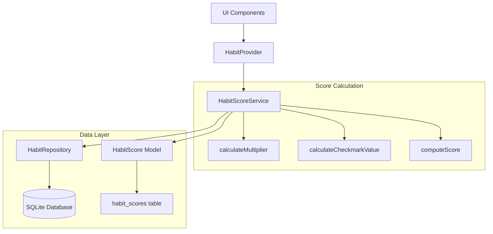

# Design Document: Habit Score System

## Overview

The Habit Score System implements an exponential moving average algorithm (inspired by Loop Habit Tracker) to calculate habit strength. Unlike simple completion percentages, this approach is more forgiving of occasional misses — a few missed days after a long streak won't destroy progress.

The core formula:
```
newScore = previousScore × multiplier + checkmarkValue × (1 - multiplier)
multiplier = 0.5^(√frequency / 13.0)
```

## Architecture



## Components and Interfaces

### HabitScoreService

```dart
/// Service for calculating habit strength scores using exponential moving average
class HabitScoreService {
  final HabitRepository _repository;

  /// Calculate the current score for a habit
  Future<double> calculateScore(int habitId, Habit habit) async;

  /// Calculate the decay multiplier based on habit frequency
  double calculateMultiplier(double frequency);

  /// Calculate the checkmark value for a day's completion
  double calculateCheckmarkValue(Habit habit, List<HabitEvent> events);

  /// Compute the new score using the exponential moving average formula
  double computeScore(double previousScore, double multiplier, double checkmarkValue);

  /// Get the frequency value for a habit (repetitions per day)
  double getFrequencyValue(Habit habit);

  /// Recalculate and cache the score for a habit
  Future<HabitScore> recalculateScore(int habitId) async;
}
```

### HabitScore Model

```dart
/// Model representing a habit's strength score
class HabitScore {
  final int habitId;
  final double score;           // 0.0 to 1.0
  final DateTime calculatedAt;
  final DateTime? lastEventDate;

  /// Score as percentage (0-100)
  int get percentage => (score * 100).round();
}
```

### Database Schema Extension

```sql
CREATE TABLE habit_scores (
  habit_id INTEGER PRIMARY KEY,
  score REAL NOT NULL DEFAULT 0.0,
  calculated_at TEXT NOT NULL,
  last_event_date TEXT,
  FOREIGN KEY (habit_id) REFERENCES habits(habit_id) ON DELETE CASCADE
);
```

## Data Models

### HabitScore

| Field | Type | Description |
|-------|------|-------------|
| habitId | int | Foreign key to habits table |
| score | double | Current score (0.0 - 1.0) |
| calculatedAt | DateTime | When score was last calculated |
| lastEventDate | DateTime? | Date of last processed event |

### Frequency Mapping

| Habit Frequency | Frequency Value | Multiplier |
|-----------------|-----------------|------------|
| Daily | 1.0 | ~0.948 |
| Weekly (1x) | 1/7 ≈ 0.143 | ~0.980 |
| Weekly (3x) | 3/7 ≈ 0.429 | ~0.961 |
| Monthly | 1/30 ≈ 0.033 | ~0.990 |
| Custom (n/d) | n/d | varies |

## Correctness Properties

*A property is a characteristic or behavior that should hold true across all valid executions of a system-essentially, a formal statement about what the system should do. Properties serve as the bridge between human-readable specifications and machine-verifiable correctness guarantees.*

### Property 1: Score bounds invariant
*For any* habit and any sequence of events, the calculated score SHALL always be in the range [0.0, 1.0]
**Validates: Requirements 1.1**

### Property 2: Completion increases score
*For any* habit with a previous score < 1.0, completing the habit (checkmarkValue = 1.0) SHALL result in a new score that is greater than the previous score
**Validates: Requirements 1.2**

### Property 3: Miss decreases score
*For any* habit with a previous score > 0.0, missing the habit on an active day (checkmarkValue = 0.0) SHALL result in a new score that is less than the previous score
**Validates: Requirements 1.3**

### Property 4: Multiplier formula correctness
*For any* frequency value > 0, the calculated multiplier SHALL equal `pow(0.5, sqrt(frequency) / 13.0)`
**Validates: Requirements 2.1, 2.4**

### Property 5: Checkmark value for minimum goals
*For any* value habit with GoalType.minimum, the checkmark value SHALL equal `min(1.0, actualValue / targetValue)` when targetValue > 0
**Validates: Requirements 3.1, 3.2**

### Property 6: Checkmark value for maximum goals
*For any* value habit with GoalType.maximum, the checkmark value SHALL equal `max(0.0, 1.0 - (actualValue - targetValue) / targetValue)` clamped to [0.0, 1.0]
**Validates: Requirements 3.3**

### Property 7: Active days filtering
*For any* habit with specific active weekdays, score calculation SHALL only process days that match the active weekdays configuration
**Validates: Requirements 5.1**

### Property 8: Skip entries preserve score
*For any* habit and any day marked as "skip", the score SHALL remain unchanged from the previous day's score
**Validates: Requirements 5.2**

### Property 9: Score serialization round-trip
*For any* valid HabitScore object, serializing to map and deserializing back SHALL produce an equivalent object
**Validates: Requirements 7.3, 7.4**

## Error Handling

| Scenario | Handling |
|----------|----------|
| No events for habit | Return score of 0.0 |
| Invalid frequency (0 or negative) | Default to daily frequency (1.0) |
| Target value is 0 | Return checkmark value of 1.0 (avoid division by zero) |
| Database read failure | Return cached score or 0.0 with error logging |
| Habit not found | Return null or throw HabitNotFoundException |

## Testing Strategy

### Property-Based Testing

The implementation will use the `fast_check` package for property-based testing in Dart. Each correctness property will be implemented as a property-based test with a minimum of 100 iterations.

Tests will be annotated with the format: `**Feature: habit-score-system, Property {number}: {property_text}**`

### Unit Tests

- Test specific edge cases (empty events, zero target, boundary scores)
- Test frequency calculations for known values (daily ≈ 0.948, weekly ≈ 0.980)
- Test integration with existing HabitStatisticsService

### Test Data Generators

```dart
// Generator for valid habits with various frequencies
Arbitrary<Habit> arbitraryHabit();

// Generator for habit events within a date range
Arbitrary<List<HabitEvent>> arbitraryEvents(Habit habit, DateTime from, DateTime to);

// Generator for valid scores in range [0.0, 1.0]
Arbitrary<double> arbitraryScore();

// Generator for valid frequency values
Arbitrary<double> arbitraryFrequency();
```
