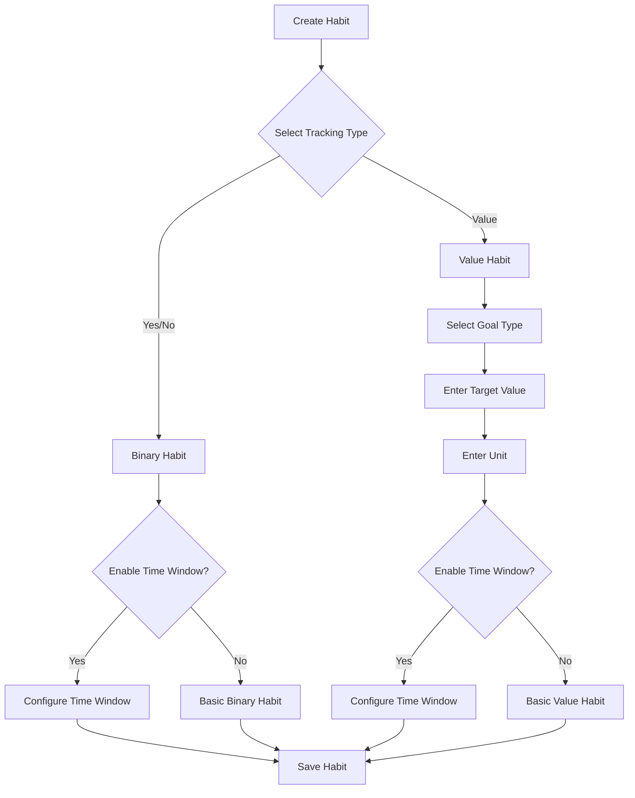
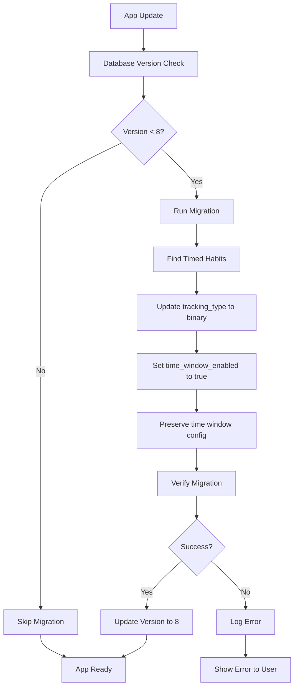
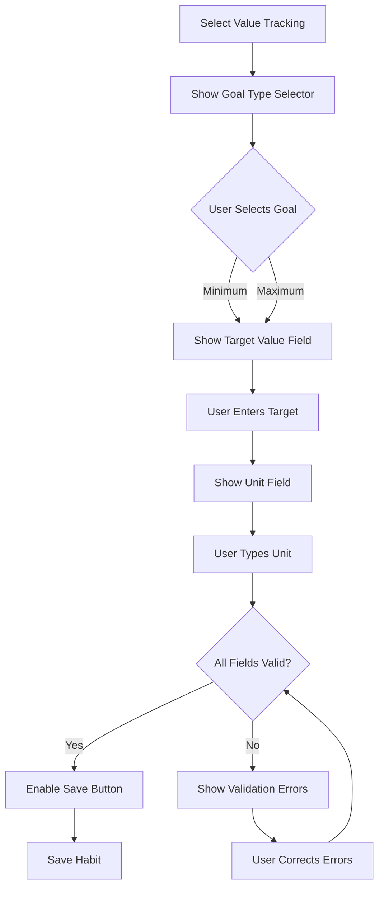

# Design Document

## Overview

This design addresses the simplification of habit tracking types and improvement of the unit input experience. The core changes involve:

1. **Removing "Timed" as a separate tracking type** - Time windows become an optional layer that can be applied to both Yes/No and Value habits
2. **Simplifying unit input** - Replacing chip-based suggestions with a straightforward text field
3. **Maintaining existing functionality** - Time windows, quality layers, and active days continue to work as designed
4. **Database migration** - Converting existing "timed" habits to "binary" habits with time windows enabled

## Architecture

### Current State

The system currently has three tracking types:
- `TrackingType.binary` - Yes/No completion
- `TrackingType.value` - Numeric value tracking
- `TrackingType.timed` - Time-based tracking

Time windows and quality layers are already implemented as optional features that can be enabled on any habit.

### Target State

The system will have two tracking types:
- `TrackingType.binary` - Yes/No completion (with optional time window)
- `TrackingType.value` - Numeric value tracking with min/max goals (with optional time window)

The `TrackingType.timed` enum value will be removed, and existing timed habits will be migrated to binary habits with time windows enabled.

## Components and Interfaces

### 1. Enum Updates

**File:** `lib/features/habits/models/enums/tracking_type.dart`

**Changes:**
- Remove `timed` from the `TrackingType` enum
- Keep only `binary` and `value`

**Impact:**
- All references to `TrackingType.timed` must be updated
- The enum will have only two values

### 2. Goal Type Updates

**File:** `lib/features/habits/models/enums/goal_type.dart`

**Changes:**
- Remove `none` from the `GoalType` enum
- Keep only `minimum` and `maximum`
- Make goal type required for value-based habits

**Impact:**
- Value habits must always have either a minimum or maximum goal
- Validation logic needs to enforce goal type selection for value habits

### 3. UI Component Updates

#### TrackingTypeSelector Widget

**File:** `lib/features/habits/widgets/forms/tracking_type_selector.dart`

**Changes:**
- Remove the "Timed" segment button
- Keep only "Yes/No" and "Value" options
- Update icons and labels as needed

#### GoalTypeSelector Widget

**File:** `lib/features/habits/widgets/forms/goal_type_selector.dart`

**Changes:**
- Remove the "None" segment button
- Keep only "Minimum" and "Maximum" options
- Update to reflect that goal type is required for value habits

#### Add/Edit Habit Screens

**Files:**
- `lib/features/habits/screens/add_habit_screen.dart`
- `lib/features/habits/screens/edit_habit_screen.dart`

**Changes:**
- Remove chip-based unit suggestions (`_buildUnitChip` method)
- Replace with simple text field for unit input
- Update conditional rendering logic:
  - Show goal type selector only for value habits
  - Show target value field only when value tracking is selected
  - Show unit field only for value habits
  - Make goal type, target value, and unit required for value habits
- Update validation:
  - Require goal type selection for value habits
  - Require target value for value habits
  - Require unit for value habits
  - Remove validation that allowed goal type "none"

### 4. Database Migration

**File:** `lib/core/services/database_service.dart`

**Migration Strategy:**

Create a new database version (version 8) that:
1. Identifies all habits with `tracking_type = 'timed'`
2. Updates these habits to:
   - Set `tracking_type = 'binary'`
   - Set `time_window_enabled = 1`
   - Preserve all existing time window configuration (`time_window_start`, `time_window_end`, `time_window_mode`)
3. Ensures no habits remain with `tracking_type = 'timed'`

**Migration SQL:**
```sql
UPDATE habits 
SET tracking_type = 'binary',
    time_window_enabled = 1
WHERE tracking_type = 'timed';
```

### 5. Event Logging Updates

**File:** `lib/features/habits/widgets/log_habit_event_dialog.dart`

**Changes:**
- Remove `_buildTimedInputs()` method
- Remove conditional rendering for `TrackingType.timed`
- Remove timed-specific event creation logic in `_createEvent()`
- Time recording will be handled through the time window feature for both binary and value habits

## Data Models

### Habit Model

**File:** `lib/features/habits/models/habit.dart`

**No structural changes needed** - The model already supports:
- `trackingType` (will only accept `binary` or `value`)
- `goalType` (will only accept `minimum` or `maximum` for value habits)
- `targetValue` (required for value habits)
- `unit` (required for value habits)
- `timeWindowEnabled` (optional for both tracking types)
- `qualityLayerEnabled` (optional for both tracking types)

**Validation changes:**
- Ensure `goalType` is not `none` for value habits
- Ensure `targetValue` is provided for value habits
- Ensure `unit` is provided for value habits

### HabitEvent Model

**File:** `lib/features/habits/models/habit_event.dart`

**No changes needed** - The model already supports:
- `completed` (for binary habits)
- `value` and `valueDelta` (for value habits)
- `timeRecorded` (for time window tracking)
- `withinTimeWindow` (for time window validation)
- `qualityAchieved` (for quality layer)

## Error Handling

### Validation Errors

**Add Habit Screen:**
- Show error if value habit is created without goal type
- Show error if value habit is created without target value
- Show error if value habit is created without unit
- Show error if target value is not a positive number

**Edit Habit Screen:**
- Same validation as add habit screen
- Prevent changing from value to binary if it would lose critical data (warn user)

### Migration Errors

**Database Migration:**
- Log any habits that fail to migrate
- Provide fallback to mark habits as inactive if migration fails
- Display user-friendly error message if migration fails completely

## Testing Strategy

### Unit Tests

1. **Enum Tests:**
   - Verify `TrackingType` enum only contains `binary` and `value`
   - Verify `GoalType` enum only contains `minimum` and `maximum`
   - Test enum serialization/deserialization

2. **Validation Tests:**
   - Test that value habits require goal type
   - Test that value habits require target value
   - Test that value habits require unit
   - Test that binary habits don't require these fields

3. **Migration Tests:**
   - Test migration of timed habits to binary with time window
   - Test that time window settings are preserved
   - Test that non-timed habits are not affected

### Widget Tests

1. **TrackingTypeSelector:**
   - Verify only two options are displayed
   - Test selection behavior
   - Test that timed option is not present

2. **GoalTypeSelector:**
   - Verify only two options are displayed
   - Test selection behavior
   - Test that none option is not present

3. **Add/Edit Habit Forms:**
   - Test conditional field visibility based on tracking type
   - Test unit field accepts text input
   - Test that chip suggestions are not present
   - Test form validation for value habits

### Integration Tests

1. **Habit Creation Flow:**
   - Create binary habit without time window
   - Create binary habit with time window
   - Create value habit with minimum goal
   - Create value habit with maximum goal
   - Verify all habits save correctly

2. **Habit Editing Flow:**
   - Edit existing binary habit
   - Edit existing value habit
   - Change tracking type and verify field updates
   - Verify validation works correctly

3. **Event Logging Flow:**
   - Log event for binary habit
   - Log event for value habit
   - Log event with time window
   - Log event with quality layer
   - Verify all events save correctly

4. **Migration Flow:**
   - Create database with timed habits
   - Run migration
   - Verify timed habits converted to binary with time window
   - Verify habit functionality after migration

## UI/UX Considerations

### Tracking Type Selection

**Before:**
```
[Yes/No] [Value] [Timed]
```

**After:**
```
[Yes/No] [Value]
```

### Unit Input

**Before:**
```
Unit: [text field]
Suggestions: [pages] [reps] [km] [glasses] [minutes]
```

**After:**
```
Unit: [text field]
(No chip suggestions)
```

### Value Habit Configuration Flow

1. User selects "Value" tracking type
2. System immediately shows:
   - Goal Type selector (Minimum/Maximum) - **required**
   - Target Value field - **required**
   - Unit field - **required**
3. User must fill all three fields to save

### Time Window Configuration

- Available in "Advanced Options" section for both tracking types
- Toggle to enable/disable
- When enabled, shows start time, end time, and mode selectors
- Works identically for both binary and value habits

### Migration User Experience

- Migration happens automatically on app update
- No user action required
- Existing timed habits continue to function as binary habits with time windows
- Users see no difference in behavior, only in the creation/edit UI

## Implementation Notes

### Order of Implementation

1. **Database Migration** - Must be done first to ensure data integrity
2. **Enum Updates** - Remove timed and none values
3. **Widget Updates** - Update selectors and forms
4. **Validation Updates** - Enforce new requirements
5. **Event Logging Updates** - Remove timed-specific logic
6. **Testing** - Comprehensive testing of all changes

### Backward Compatibility

- Database migration ensures existing data is preserved
- No breaking changes to the data model structure
- Existing habits continue to function after migration
- Event logging continues to work for all habit types

### Performance Considerations

- Migration should be fast (single UPDATE query)
- No impact on runtime performance
- No changes to indexing or query patterns

## Mermaid Diagrams

### Tracking Type Selection Flow



### Database Migration Flow



### Value Habit Configuration


