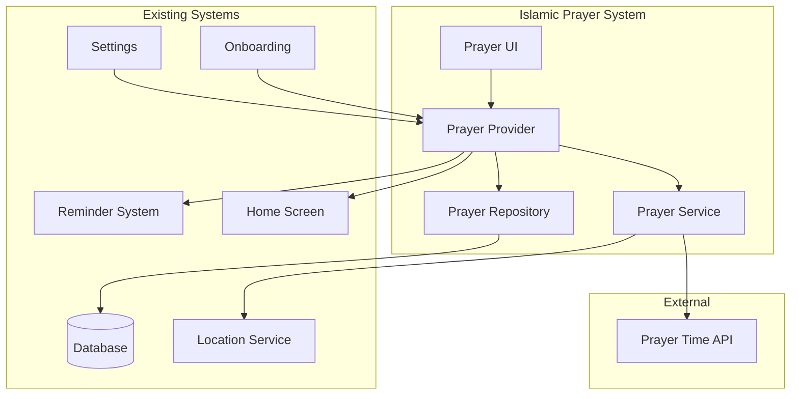

# Design Document: Islamic Prayer System

## Overview

The Islamic Prayer System is a dedicated feature module for tracking the five daily prayers (Salah) in the numu app. It operates as a self-contained feature with its own data models, database tables, repositories, services, and UI components, while integrating with existing systems (home screen, reminders, settings, onboarding).

The system fetches accurate prayer times from an external API based on user location, tracks prayer completion with a 30-minute time window, supports congregation (Jamaah) quality tracking, and calculates prayer scores using the existing habit scoring algorithms.

## Architecture

The Islamic Prayer System follows the established feature-first architecture pattern used throughout the numu app:

```
lib/features/islamic/
├── models/
│   ├── prayer.dart              # Prayer definition model
│   ├── prayer_event.dart        # Prayer completion event
│   ├── prayer_schedule.dart     # Daily prayer times
│   ├── prayer_score.dart        # Prayer score cache
│   ├── prayer_settings.dart     # User prayer preferences
│   └── enums/
│       ├── prayer_type.dart     # Fajr, Dhuhr, Asr, Maghrib, Isha
│       ├── prayer_status.dart   # Pending, Completed, Missed
│       └── calculation_method.dart # Prayer time calculation methods
├── repositories/
│   ├── prayer_repository.dart   # Prayer data access
│   └── prayer_settings_repository.dart # Settings persistence
├── services/
│   ├── prayer_time_service.dart # API integration for prayer times
│   ├── prayer_score_service.dart # Score calculation (reuses habit algorithms)
│   ├── prayer_location_service.dart # Location handling
│   └── prayer_reminder_service.dart # Reminder integration
├── providers/
│   ├── prayer_provider.dart     # Main prayer state
│   ├── prayer_schedule_provider.dart # Today's prayer times
│   ├── prayer_settings_provider.dart # User preferences
│   └── prayer_score_provider.dart # Score state
├── screens/
│   ├── islamic_prayer_screen.dart # Main prayer dashboard
│   └── prayer_settings_screen.dart # Prayer configuration
└── widgets/
    ├── prayer_card.dart         # Individual prayer display
    ├── prayer_log_dialog.dart   # Prayer completion dialog
    ├── prayer_progress_header.dart # Daily progress summary
    ├── prayer_score_display.dart # Score visualization
    └── next_prayer_countdown.dart # Time until next prayer
```

### Integration Points



## Components and Interfaces

### 1. Prayer Time Service

Responsible for fetching and caching prayer times from external API.

```dart
abstract class IPrayerTimeService {
  /// Fetch prayer times for a specific date and location
  Future<PrayerSchedule> fetchPrayerTimes({
    required double latitude,
    required double longitude,
    required DateTime date,
    required CalculationMethod method,
  });
  
  /// Get cached prayer times for today
  Future<PrayerSchedule?> getCachedSchedule(DateTime date);
  
  /// Check if cache is valid for current location
  Future<bool> isCacheValid(double latitude, double longitude);
}
```

### 2. Prayer Repository

Data access layer for prayer-related database operations.

```dart
abstract class IPrayerRepository {
  // Prayer Events
  Future<int> logPrayerEvent(PrayerEvent event);
  Future<List<PrayerEvent>> getEventsForDate(DateTime date);
  Future<List<PrayerEvent>> getEventsForPrayer(PrayerType type, {DateTime? startDate, DateTime? endDate});
  Future<void> deletePrayerEvent(int eventId);
  
  // Prayer Schedule
  Future<void> savePrayerSchedule(PrayerSchedule schedule);
  Future<PrayerSchedule?> getPrayerSchedule(DateTime date);
  Future<void> deleteOldSchedules(DateTime beforeDate);
  
  // Prayer Score
  Future<void> savePrayerScore(PrayerScore score);
  Future<PrayerScore?> getPrayerScore(PrayerType type);
  Future<Map<PrayerType, PrayerScore>> getAllPrayerScores();
}
```

### 3. Prayer Score Service

Calculates prayer scores using the existing exponential moving average algorithm.

```dart
abstract class IPrayerScoreService {
  /// Calculate score for a specific prayer type
  Future<PrayerScore> calculateScore(PrayerType type);
  
  /// Calculate overall prayer score (average of all 5 prayers)
  Future<double> calculateOverallScore();
  
  /// Recalculate and cache all prayer scores
  Future<void> recalculateAllScores();
  
  /// Get streak information for a prayer type
  Future<PrayerStreak> getStreak(PrayerType type);
}
```

### 4. Prayer Location Service

Handles location permissions and coordinates retrieval.

```dart
abstract class IPrayerLocationService {
  /// Check if location permission is granted
  Future<bool> hasLocationPermission();
  
  /// Request location permission
  Future<bool> requestLocationPermission();
  
  /// Get current location coordinates
  Future<LocationCoordinates?> getCurrentLocation();
  
  /// Check if location has changed significantly (>10km)
  Future<bool> hasLocationChanged(double lastLat, double lastLng);
}
```

### 5. Prayer Reminder Service

Integrates with existing reminder system for prayer notifications.

```dart
abstract class IPrayerReminderService {
  /// Schedule reminders for all prayers based on today's schedule
  Future<void> scheduleAllPrayerReminders(PrayerSchedule schedule);
  
  /// Update reminder for a specific prayer
  Future<void> updatePrayerReminder(PrayerType type, DateTime prayerTime);
  
  /// Cancel all prayer reminders
  Future<void> cancelAllPrayerReminders();
  
  /// Get reminder settings for a prayer
  Future<PrayerReminderSettings?> getReminderSettings(PrayerType type);
}
```

## Data Models

### Prayer Type Enum

```dart
enum PrayerType {
  fajr,    // Dawn prayer
  dhuhr,   // Noon prayer
  asr,     // Afternoon prayer
  maghrib, // Sunset prayer
  isha;    // Night prayer
  
  String get arabicName => switch (this) {
    PrayerType.fajr => 'الفجر',
    PrayerType.dhuhr => 'الظهر',
    PrayerType.asr => 'العصر',
    PrayerType.maghrib => 'المغرب',
    PrayerType.isha => 'العشاء',
  };
  
  String get englishName => switch (this) {
    PrayerType.fajr => 'Fajr',
    PrayerType.dhuhr => 'Dhuhr',
    PrayerType.asr => 'Asr',
    PrayerType.maghrib => 'Maghrib',
    PrayerType.isha => 'Isha',
  };
  
  int get sortOrder => index;
}
```

### Prayer Status Enum

```dart
enum PrayerStatus {
  pending,   // Prayer time has arrived but not yet logged
  completed, // Prayer has been logged
  missed;    // Time window expired without logging
}
```

### Calculation Method Enum

```dart
enum CalculationMethod {
  muslimWorldLeague,
  isna,
  egyptian,
  ummAlQura,
  karachi,
  tehran,
  gulf;
  
  String get displayName => switch (this) {
    CalculationMethod.muslimWorldLeague => 'Muslim World League',
    CalculationMethod.isna => 'ISNA (North America)',
    CalculationMethod.egyptian => 'Egyptian General Authority',
    CalculationMethod.ummAlQura => 'Umm Al-Qura (Makkah)',
    CalculationMethod.karachi => 'University of Karachi',
    CalculationMethod.tehran => 'Institute of Geophysics, Tehran',
    CalculationMethod.gulf => 'Gulf Region',
  };
  
  int get apiValue => index;
}
```

### Prayer Schedule Model

```dart
class PrayerSchedule {
  final int? id;
  final DateTime date;
  final double latitude;
  final double longitude;
  final CalculationMethod method;
  final DateTime fajrTime;
  final DateTime dhuhrTime;
  final DateTime asrTime;
  final DateTime maghribTime;
  final DateTime ishaTime;
  final DateTime sunrise; // For reference
  final DateTime createdAt;
  
  DateTime getTimeForPrayer(PrayerType type) => switch (type) {
    PrayerType.fajr => fajrTime,
    PrayerType.dhuhr => dhuhrTime,
    PrayerType.asr => asrTime,
    PrayerType.maghrib => maghribTime,
    PrayerType.isha => ishaTime,
  };
  
  DateTime getTimeWindowEnd(PrayerType type, int windowMinutes) {
    return getTimeForPrayer(type).add(Duration(minutes: windowMinutes));
  }
}
```

### Prayer Event Model

```dart
class PrayerEvent {
  final int? id;
  final PrayerType prayerType;
  final DateTime eventDate;
  final DateTime eventTimestamp;
  final DateTime? actualPrayerTime; // When user actually prayed
  final bool prayedInJamaah; // Quality layer: congregation
  final bool withinTimeWindow;
  final String? notes;
  final DateTime createdAt;
  final DateTime updatedAt;
}
```

### Prayer Score Model

```dart
class PrayerScore {
  final PrayerType prayerType;
  final double score; // 0.0 to 1.0
  final int currentStreak;
  final int longestStreak;
  final double jamaahRate; // Percentage prayed in congregation
  final DateTime calculatedAt;
  final DateTime? lastEventDate;
  
  int get percentage => (score * 100).round();
}
```

### Prayer Settings Model

```dart
class PrayerSettings {
  final int? id;
  final bool isEnabled;
  final CalculationMethod calculationMethod;
  final int timeWindowMinutes; // Default 30
  final double? lastLatitude;
  final double? lastLongitude;
  final Map<PrayerType, bool> reminderEnabled;
  final Map<PrayerType, int> reminderOffsetMinutes;
  final DateTime createdAt;
  final DateTime updatedAt;
}
```

### Database Schema

```sql
-- Prayer schedules (cached daily prayer times)
CREATE TABLE prayer_schedules (
  schedule_id INTEGER PRIMARY KEY AUTOINCREMENT,
  date TEXT NOT NULL UNIQUE,
  latitude REAL NOT NULL,
  longitude REAL NOT NULL,
  calculation_method TEXT NOT NULL,
  fajr_time TEXT NOT NULL,
  dhuhr_time TEXT NOT NULL,
  asr_time TEXT NOT NULL,
  maghrib_time TEXT NOT NULL,
  isha_time TEXT NOT NULL,
  sunrise_time TEXT NOT NULL,
  created_at TEXT NOT NULL
);

-- Prayer events (completion logs)
CREATE TABLE prayer_events (
  event_id INTEGER PRIMARY KEY AUTOINCREMENT,
  prayer_type TEXT NOT NULL,
  event_date TEXT NOT NULL,
  event_timestamp TEXT NOT NULL,
  actual_prayer_time TEXT,
  prayed_in_jamaah INTEGER NOT NULL DEFAULT 0,
  within_time_window INTEGER NOT NULL DEFAULT 0,
  notes TEXT,
  created_at TEXT NOT NULL,
  updated_at TEXT NOT NULL
);

-- Prayer scores (cached scores per prayer type)
CREATE TABLE prayer_scores (
  prayer_type TEXT PRIMARY KEY,
  score REAL NOT NULL DEFAULT 0.0,
  current_streak INTEGER NOT NULL DEFAULT 0,
  longest_streak INTEGER NOT NULL DEFAULT 0,
  jamaah_rate REAL NOT NULL DEFAULT 0.0,
  calculated_at TEXT NOT NULL,
  last_event_date TEXT
);

-- Prayer settings (user preferences)
CREATE TABLE prayer_settings (
  id INTEGER PRIMARY KEY CHECK (id = 1),
  is_enabled INTEGER NOT NULL DEFAULT 0,
  calculation_method TEXT NOT NULL DEFAULT 'muslimWorldLeague',
  time_window_minutes INTEGER NOT NULL DEFAULT 30,
  last_latitude REAL,
  last_longitude REAL,
  reminder_fajr_enabled INTEGER NOT NULL DEFAULT 1,
  reminder_dhuhr_enabled INTEGER NOT NULL DEFAULT 1,
  reminder_asr_enabled INTEGER NOT NULL DEFAULT 1,
  reminder_maghrib_enabled INTEGER NOT NULL DEFAULT 1,
  reminder_isha_enabled INTEGER NOT NULL DEFAULT 1,
  reminder_fajr_offset INTEGER NOT NULL DEFAULT 15,
  reminder_dhuhr_offset INTEGER NOT NULL DEFAULT 15,
  reminder_asr_offset INTEGER NOT NULL DEFAULT 15,
  reminder_maghrib_offset INTEGER NOT NULL DEFAULT 15,
  reminder_isha_offset INTEGER NOT NULL DEFAULT 15,
  created_at TEXT NOT NULL,
  updated_at TEXT NOT NULL
);

-- Indexes for performance
CREATE INDEX idx_prayer_events_date ON prayer_events (event_date);
CREATE INDEX idx_prayer_events_type_date ON prayer_events (prayer_type, event_date);
CREATE INDEX idx_prayer_schedules_date ON prayer_schedules (date);
```


## Correctness Properties

*A property is a characteristic or behavior that should hold true across all valid executions of a system-essentially, a formal statement about what the system should do. Properties serve as the bridge between human-readable specifications and machine-verifiable correctness guarantees.*

### Property 1: Prayer Schedule Round-Trip Persistence

*For any* valid prayer schedule with date, coordinates, calculation method, and five prayer times, storing the schedule and then retrieving it by date SHALL produce an equivalent schedule with all fields preserved.

**Validates: Requirements 1.2**

### Property 2: Prayer Event Round-Trip Persistence

*For any* valid prayer event with prayer type, event date, timestamp, actual prayer time, Jamaah flag, and time window flag, storing the event and then retrieving it SHALL produce an equivalent event with all fields preserved.

**Validates: Requirements 2.1, 2.2, 2.3**

### Property 3: Location Change Detection

*For any* two coordinate pairs (lat1, lng1) and (lat2, lng2), the location change detection function SHALL return true if and only if the Haversine distance between the points exceeds 10 kilometers.

**Validates: Requirements 1.3**

### Property 4: Prayer Status Calculation

*For any* prayer time, time window duration, current time, and list of prayer events for that day, the calculated prayer status SHALL be exactly one of: pending (prayer time has arrived, window not expired, not logged), completed (prayer logged), or missed (window expired, not logged).

**Validates: Requirements 2.4, 2.5**

### Property 5: Future Time Validation

*For any* prayer event with an actual prayer time in the future relative to the current timestamp, the validation function SHALL reject the event and return an error.

**Validates: Requirements 2.6**

### Property 6: Score Calculation Consistency

*For any* sequence of prayer events for a single prayer type, the prayer score calculation SHALL produce the same result as the habit score service when given equivalent input data (same completion dates and values).

**Validates: Requirements 4.1**

### Property 7: Overall Score Aggregation

*For any* set of five individual prayer scores (one per prayer type), the overall prayer score SHALL equal the arithmetic mean of the five individual scores.

**Validates: Requirements 4.2, 4.3**

### Property 8: Streak Calculation Correctness

*For any* sequence of prayer events for a single prayer type ordered by date, the current streak SHALL equal the count of consecutive completed days ending at today (or the most recent completed day), and the longest streak SHALL be greater than or equal to the current streak.

**Validates: Requirements 4.4**

### Property 9: Jamaah Quality Multiplier

*For any* two identical sequences of prayer events where one sequence has all Jamaah flags set to true and the other has all set to false, the Jamaah rate for the first sequence SHALL be 100% and for the second SHALL be 0%.

**Validates: Requirements 4.5**

### Property 10: Weekly Completion Percentage

*For any* prayer type and week date range, the weekly completion percentage SHALL equal (number of completed prayers / number of days in range) × 100, bounded between 0 and 100.

**Validates: Requirements 4.6**

### Property 11: Reminder Scheduling with Offset

*For any* prayer time and reminder offset in minutes, the scheduled reminder time SHALL equal the prayer time minus the offset duration.

**Validates: Requirements 5.2, 5.3**

### Property 12: Next Prayer Identification

*For any* prayer schedule and current time, the next pending prayer SHALL be the prayer with the earliest start time that is after the current time and has not been completed.

**Validates: Requirements 6.3, 7.2**

### Property 13: Completion Count Accuracy

*For any* list of prayer events for a given day, the completion count SHALL equal the number of distinct prayer types that have at least one completed event.

**Validates: Requirements 6.5**

### Property 14: Daily Progress Inclusion

*For any* daily items list that includes prayers, the overall completion percentage SHALL include prayer completions in the calculation alongside habits and tasks.

**Validates: Requirements 7.5**

### Property 15: Visibility Toggle Consistency

*For any* enabled/disabled state of the Islamic Prayer System, when disabled, all prayer-related UI elements SHALL be hidden AND all stored prayer data (events, schedules, scores) SHALL remain intact in the database.

**Validates: Requirements 7.4, 8.2, 12.3**

### Property 16: Calculation Method Persistence

*For any* valid calculation method selected by the user, storing the setting and then retrieving it SHALL return the same calculation method.

**Validates: Requirements 8.4**

### Property 17: Time Window Configuration Persistence

*For any* valid time window duration (positive integer minutes), storing the setting and then retrieving it SHALL return the same duration value.

**Validates: Requirements 8.5**

### Property 18: Enabled State Propagation

*For any* change to the Islamic Prayer System enabled state (from profile, settings, or onboarding), the state change SHALL be immediately reflected in all dependent providers and UI components.

**Validates: Requirements 9.2**

## Error Handling

### Location Errors

| Error Condition | Handling Strategy |
|----------------|-------------------|
| Location permission denied | Display explanation dialog with link to app settings; disable prayer time fetching |
| Location unavailable | Use last known location if available; show offline indicator |
| GPS timeout | Retry with exponential backoff (3 attempts); fall back to cached location |

### API Errors

| Error Condition | Handling Strategy |
|----------------|-------------------|
| Network unavailable | Use cached prayer schedule; show offline indicator |
| API rate limit | Queue request with delay; use cached data |
| Invalid API response | Log error; use cached data; notify user if no cache available |
| API timeout | Retry once; fall back to cached data |

### Data Validation Errors

| Error Condition | Handling Strategy |
|----------------|-------------------|
| Invalid prayer time (future) | Reject with user-friendly error message |
| Missing required fields | Prevent save; highlight missing fields |
| Database write failure | Retry once; show error toast if persistent |

### State Errors

| Error Condition | Handling Strategy |
|----------------|-------------------|
| Provider initialization failure | Log error; show retry option |
| Stale cache data | Refresh on next app launch; show last updated timestamp |

## Testing Strategy

### Property-Based Testing Framework

The Islamic Prayer System will use the `glados` package for property-based testing in Dart. This library provides:
- Automatic test case generation
- Shrinking of failing cases to minimal examples
- Custom generators for domain-specific types

### Unit Tests

Unit tests will cover:
- Model serialization/deserialization (fromMap/toMap)
- Enum conversions
- Time calculations (time window expiration, countdown)
- Distance calculations (Haversine formula)
- Score calculation edge cases

### Property-Based Tests

Each correctness property will be implemented as a property-based test:

1. **Property 1 (Schedule Round-Trip)**: Generate random PrayerSchedule instances, save to database, retrieve, and verify equality.

2. **Property 2 (Event Round-Trip)**: Generate random PrayerEvent instances with all field combinations, save, retrieve, verify.

3. **Property 3 (Location Change)**: Generate random coordinate pairs, calculate distance, verify threshold detection.

4. **Property 4 (Status Calculation)**: Generate random prayer times, current times, and event lists; verify status is exactly one of three values.

5. **Property 5 (Future Validation)**: Generate future timestamps, verify rejection.

6. **Property 6 (Score Consistency)**: Generate event sequences, calculate with both prayer and habit services, verify equality.

7. **Property 7 (Overall Score)**: Generate 5 random scores, verify average calculation.

8. **Property 8 (Streak Calculation)**: Generate date sequences with gaps, verify streak counts.

9. **Property 9 (Jamaah Rate)**: Generate events with varying Jamaah flags, verify rate calculation.

10. **Property 10 (Weekly Percentage)**: Generate week of events, verify percentage bounds and calculation.

11. **Property 11 (Reminder Offset)**: Generate prayer times and offsets, verify scheduled time calculation.

12. **Property 12 (Next Prayer)**: Generate schedules and current times, verify next prayer identification.

13. **Property 13 (Completion Count)**: Generate event lists, verify distinct completed prayer count.

14. **Property 14 (Daily Progress)**: Generate mixed daily items, verify prayer inclusion in percentage.

15. **Property 15 (Visibility Toggle)**: Toggle enabled state, verify UI hidden and data preserved.

16. **Property 16 (Method Persistence)**: Generate calculation methods, verify round-trip.

17. **Property 17 (Time Window Persistence)**: Generate positive integers, verify round-trip.

18. **Property 18 (State Propagation)**: Toggle state, verify all providers reflect change.

### Test Configuration

- Property tests will run with a minimum of 100 iterations each
- Each property test will be tagged with the format: `**Feature: islamic-prayer-system, Property {number}: {property_text}**`
- Tests will use in-memory SQLite database for isolation
- Custom generators will be created for:
  - `PrayerType` enum
  - `CalculationMethod` enum
  - `PrayerSchedule` with valid time ordering
  - `PrayerEvent` with valid timestamps
  - Geographic coordinates (latitude: -90 to 90, longitude: -180 to 180)

### Integration Tests

Integration tests will verify:
- Home screen displays prayers when enabled
- Reminder system receives prayer reminders
- Settings changes propagate to prayer system
- Navigation shows/hides prayer menu item
- Onboarding flow includes prayer option
