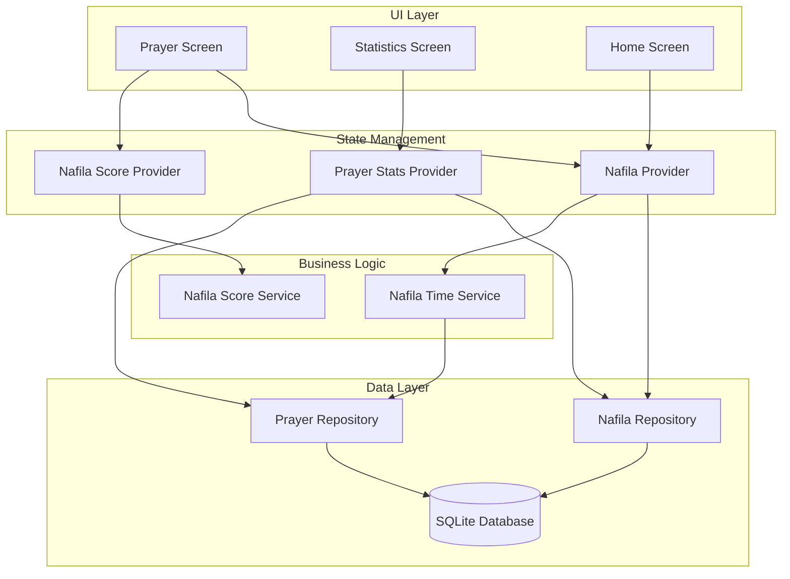

# Design Document: Nafila Prayer System

## Overview

The Nafila Prayer System extends the existing Islamic Prayer feature to support tracking of voluntary (Sunnah/Nafila) prayers. The system introduces three defined Sunnah prayer types with time-based validation, custom Nafila logging, visual integration into the prayer screen, and a comprehensive statistics screen for all prayer types.

The design follows the existing architecture patterns: feature-first structure, Riverpod state management with code generation, repository pattern for data access, and SQLite for persistence.

## Architecture



## Components and Interfaces

### 1. Models

#### NafilaType Enum
```dart
enum NafilaType {
  sunnahFajr,   // 2 rakats before Fajr prayer
  duha,         // 2-12 rakats after sunrise until before Dhuhr
  shafiWitr,    // Night prayers after Isha
  custom;       // User-defined Nafila prayers
  
  String get arabicName;
  String get englishName;
  int get minRakats;
  int get maxRakats;
  int get defaultRakats;
}
```

#### NafilaEvent Model
```dart
class NafilaEvent {
  final int? id;
  final NafilaType nafilaType;
  final DateTime eventDate;
  final DateTime eventTimestamp;
  final int rakatCount;
  final DateTime? actualPrayerTime;
  final String? notes;
  final DateTime createdAt;
  final DateTime updatedAt;
  
  Map<String, dynamic> toMap();
  factory NafilaEvent.fromMap(Map<String, dynamic> map);
  NafilaEvent copyWith({...});
}
```

#### NafilaScore Model
```dart
class NafilaScore {
  final NafilaType nafilaType;
  final double score;
  final int currentStreak;
  final int longestStreak;
  final int totalRakats;
  final int totalCompletions;
  final DateTime calculatedAt;
  final DateTime? lastEventDate;
  
  Map<String, dynamic> toMap();
  factory NafilaScore.fromMap(Map<String, dynamic> map);
}
```

#### PrayerDayStats Model (for calendar view)
```dart
class PrayerDayStats {
  final DateTime date;
  final Map<PrayerType, bool> obligatoryCompleted;
  final Map<NafilaType, bool> nafilaCompleted;
  final int totalRakatsNafila;
}
```

### 2. Repository Layer

#### NafilaRepository
```dart
class NafilaRepository {
  // Event operations
  Future<NafilaEvent> logNafilaEvent(NafilaEvent event);
  Future<NafilaEvent> updateNafilaEvent(NafilaEvent event);
  Future<void> deleteNafilaEvent(int eventId);
  Future<List<NafilaEvent>> getEventsForDate(DateTime date);
  Future<List<NafilaEvent>> getEventsForTypeOnDate(NafilaType type, DateTime date);
  Future<List<NafilaEvent>> getEventsInRange(DateTime start, DateTime end);
  
  // Score operations
  Future<void> saveNafilaScore(NafilaScore score);
  Future<NafilaScore?> getNafilaScore(NafilaType type);
  Future<Map<NafilaType, NafilaScore>> getAllNafilaScores();
}
```

### 3. Service Layer

#### NafilaTimeService
```dart
class NafilaTimeService {
  // Time window validation using existing PrayerSchedule
  bool isValidTimeForSunnahFajr(DateTime time, PrayerSchedule schedule);
  bool isValidTimeForDuha(DateTime time, PrayerSchedule schedule);
  bool isValidTimeForShafiWitr(DateTime time, PrayerSchedule schedule, PrayerSchedule? nextDaySchedule);
  
  // Get time windows
  (DateTime start, DateTime end) getSunnahFajrWindow(PrayerSchedule schedule);
  (DateTime start, DateTime end) getDuhaWindow(PrayerSchedule schedule);
  (DateTime start, DateTime end) getShafiWitrWindow(PrayerSchedule schedule, PrayerSchedule? nextDaySchedule);
  
  // Determine which Nafila slot a time belongs to
  NafilaType? getNafilaTypeForTime(DateTime time, PrayerSchedule schedule);
}
```

#### NafilaScoreService
```dart
class NafilaScoreService {
  Future<NafilaScore> calculateScore(NafilaType type, List<NafilaEvent> events);
  Future<Map<NafilaType, NafilaScore>> calculateAllScores();
}
```

### 4. Provider Layer

#### NafilaProvider
```dart
@riverpod
class Nafila extends _$Nafila {
  Future<NafilaState> build();
  Future<void> logNafila(NafilaType type, int rakats, {DateTime? actualTime, String? notes});
  Future<void> updateNafila(NafilaEvent event);
  Future<void> deleteNafila(int eventId);
}

class NafilaState {
  final List<NafilaEvent> todayEvents;
  final Map<NafilaType, bool> definedNafilaCompleted;
  final bool isLoading;
  final String? errorMessage;
}
```

#### NafilaScoreProvider
```dart
@riverpod
class NafilaScoreNotifier extends _$NafilaScoreNotifier {
  Future<NafilaScoreState> build();
  Future<void> recalculateScores();
}

class NafilaScoreState {
  final Map<NafilaType, NafilaScore> scores;
  final int overallPercentage;
  final int totalRakatsAllTime;
}
```

#### PrayerStatsProvider (for statistics screen)
```dart
@riverpod
class PrayerStats extends _$PrayerStats {
  Future<PrayerStatsState> build();
  Future<void> loadStatsForMonth(DateTime month);
}

class PrayerStatsState {
  final List<PrayerDayStats> dailyStats;
  final Map<PrayerType, PrayerScore> obligatoryScores;
  final Map<NafilaType, NafilaScore> nafilaScores;
  final DateTime selectedMonth;
}
```

### 5. UI Components

#### NafilaIndicatorCard Widget
Small thin card displayed between obligatory prayers showing Nafila status.

```dart
class NafilaIndicatorCard extends StatelessWidget {
  final NafilaType type;
  final bool isCompleted;
  final int? rakatCount;
  final VoidCallback? onTap;
  final VoidCallback? onEditTap;
}
```

#### NafilaLogDialog Widget
Dialog for logging Nafila prayers with rakat selection.

```dart
class NafilaLogDialog extends StatelessWidget {
  final NafilaType type;
  final DateTime? scheduledWindowStart;
  final DateTime? scheduledWindowEnd;
}
```

#### PrayerCalendarView Widget
Calendar showing prayer completion for each day.

```dart
class PrayerCalendarView extends StatelessWidget {
  final List<PrayerDayStats> dailyStats;
  final DateTime selectedMonth;
  final Function(DateTime) onMonthChanged;
  final Function(DateTime) onDayTapped;
}
```

#### PrayerStatisticsScreen
Dedicated screen for comprehensive prayer statistics.

```dart
class PrayerStatisticsScreen extends ConsumerWidget {
  // Calendar view at top
  // Statistics charts/graphs below
  // Sections for obligatory prayers, defined Sunnah, and custom Nafila
}
```

## Data Models

### Database Schema

#### nafila_events Table
```sql
CREATE TABLE nafila_events (
  event_id INTEGER PRIMARY KEY AUTOINCREMENT,
  nafila_type TEXT NOT NULL,
  event_date TEXT NOT NULL,
  event_timestamp TEXT NOT NULL,
  rakat_count INTEGER NOT NULL,
  actual_prayer_time TEXT,
  notes TEXT,
  created_at TEXT NOT NULL,
  updated_at TEXT NOT NULL
);

CREATE INDEX idx_nafila_events_date ON nafila_events (event_date);
CREATE INDEX idx_nafila_events_type_date ON nafila_events (nafila_type, event_date);
```

#### nafila_scores Table
```sql
CREATE TABLE nafila_scores (
  nafila_type TEXT PRIMARY KEY,
  score REAL NOT NULL DEFAULT 0.0,
  current_streak INTEGER NOT NULL DEFAULT 0,
  longest_streak INTEGER NOT NULL DEFAULT 0,
  total_rakats INTEGER NOT NULL DEFAULT 0,
  total_completions INTEGER NOT NULL DEFAULT 0,
  calculated_at TEXT NOT NULL,
  last_event_date TEXT
);
```

#### prayer_settings Table (add column)
```sql
ALTER TABLE prayer_settings ADD COLUMN show_nafila_at_home INTEGER NOT NULL DEFAULT 1;
```


## Correctness Properties

*A property is a characteristic or behavior that should hold true across all valid executions of a system-essentially, a formal statement about what the system should do. Properties serve as the bridge between human-readable specifications and machine-verifiable correctness guarantees.*

### Property 1: Sunnah Fajr Time Validation
*For any* DateTime and PrayerSchedule, the Sunnah Fajr time validation should return true if and only if the time is between Fajr azan time and the scheduled Fajr prayer time.
**Validates: Requirements 1.3**

### Property 2: Duha Time Validation
*For any* DateTime and PrayerSchedule, the Duha time validation should return true if and only if the time is after sunrise plus 15 minutes and before Dhuhr time minus 15 minutes.
**Validates: Requirements 1.4**

### Property 3: Shaf'i/Witr Time Validation
*For any* DateTime, PrayerSchedule, and optional next-day PrayerSchedule, the Shaf'i/Witr time validation should return true if and only if the time is after Isha prayer time and before the next day's Fajr azan time.
**Validates: Requirements 1.5**

### Property 4: NafilaEvent Serialization Round-Trip
*For any* valid NafilaEvent object, serializing to a map and deserializing back should produce an equivalent NafilaEvent object with all fields matching.
**Validates: Requirements 7.4, 7.5**

### Property 5: Nafila Chronological Ordering
*For any* list of NafilaEvent objects for a given day, when sorted for display, they should be ordered by their eventTimestamp in ascending order.
**Validates: Requirements 2.3, 3.3**

### Property 6: Calendar Day Stats Aggregation
*For any* date with prayer events and Nafila events, the PrayerDayStats should correctly reflect completion status for all five obligatory prayers and three defined Sunnah types.
**Validates: Requirements 4.2**

### Property 7: Streak Calculation Consistency
*For any* sequence of NafilaEvent objects for a given NafilaType, the calculated current streak should equal the count of consecutive days with completions ending at the most recent event date.
**Validates: Requirements 4.4**

### Property 8: Rakat Aggregation Accuracy
*For any* list of NafilaEvent objects of a given type, the total rakats should equal the sum of all rakatCount values, and the average should equal total divided by event count.
**Validates: Requirements 4.5, 4.6**

### Property 9: Settings Persistence Round-Trip
*For any* boolean value for the "Show Nafila at Home" setting, saving and then loading the setting should return the same boolean value.
**Validates: Requirements 6.2**

### Property 10: Data Isolation
*For any* Nafila repository operation (create, update, delete), the prayer_events table row count should remain unchanged.
**Validates: Requirements 7.3**

## Error Handling

### Time Validation Errors
- **Invalid Time Window**: When a user attempts to log a Nafila prayer outside its valid time window, display a clear error message explaining the valid time range and offer to log it as a custom Nafila instead.
- **Missing Prayer Schedule**: If the prayer schedule is unavailable for time validation, allow logging with a warning that time validation was skipped.

### Database Errors
- **Insert/Update Failures**: Catch database exceptions, log the error, and display a user-friendly message asking to retry.
- **Migration Failures**: If table creation fails during migration, log the error and prevent the feature from loading until resolved.

### Network Errors (Statistics)
- **Calendar Data Loading**: If historical data fails to load, show cached data if available or display an error state with retry option.

### Input Validation
- **Invalid Rakat Count**: Enforce minimum (2) and maximum (12 for Duha, 11 for Witr) rakat limits with clear validation messages.
- **Empty Events**: Prevent saving events with zero rakats.

## Testing Strategy

### Property-Based Testing Framework
The system will use the `fast_check` package for Dart property-based testing. Each correctness property will be implemented as a property-based test with a minimum of 100 iterations.

### Unit Tests
Unit tests will cover:
- NafilaType enum methods (arabicName, englishName, min/max rakats)
- NafilaEvent and NafilaScore model constructors and copyWith methods
- NafilaRepository CRUD operations with in-memory SQLite database
- NafilaTimeService time window calculations
- NafilaScoreService score and streak calculations

### Property-Based Tests
Each correctness property will have a corresponding property-based test:
- **Property 1-3**: Generate random DateTimes and PrayerSchedules, verify time validation logic
- **Property 4**: Generate random NafilaEvent objects, verify serialization round-trip
- **Property 5**: Generate random lists of NafilaEvents, verify chronological ordering
- **Property 6**: Generate random prayer/Nafila events for a day, verify aggregation
- **Property 7**: Generate random event sequences, verify streak calculation
- **Property 8**: Generate random Nafila events, verify rakat sum and average
- **Property 9**: Generate random boolean values, verify settings persistence
- **Property 10**: Generate random Nafila operations, verify prayer_events unchanged

### Integration Tests
- Prayer screen displays Nafila indicator cards correctly
- Logging dialog saves events and updates UI state
- Statistics screen loads and displays calendar with correct data
- Home screen respects "Show Nafila at Home" setting
- Navigation between prayer screen and statistics screen

### Test Annotations
All property-based tests will be annotated with:
```dart
// **Feature: nafila-prayer-system, Property {number}: {property_text}**
// **Validates: Requirements X.Y**
```
